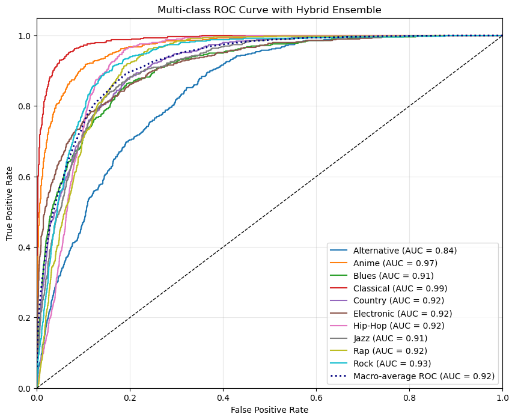
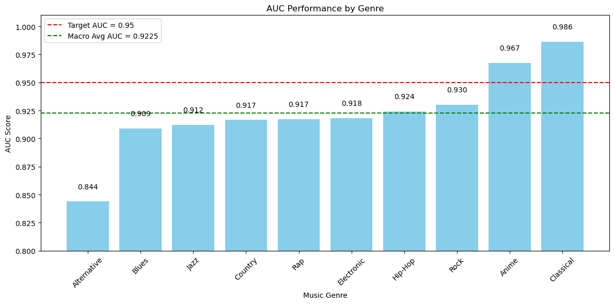
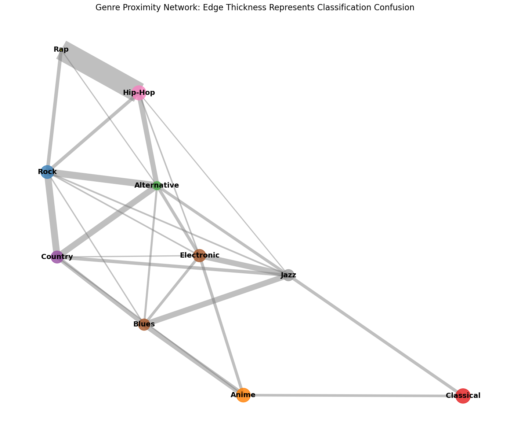
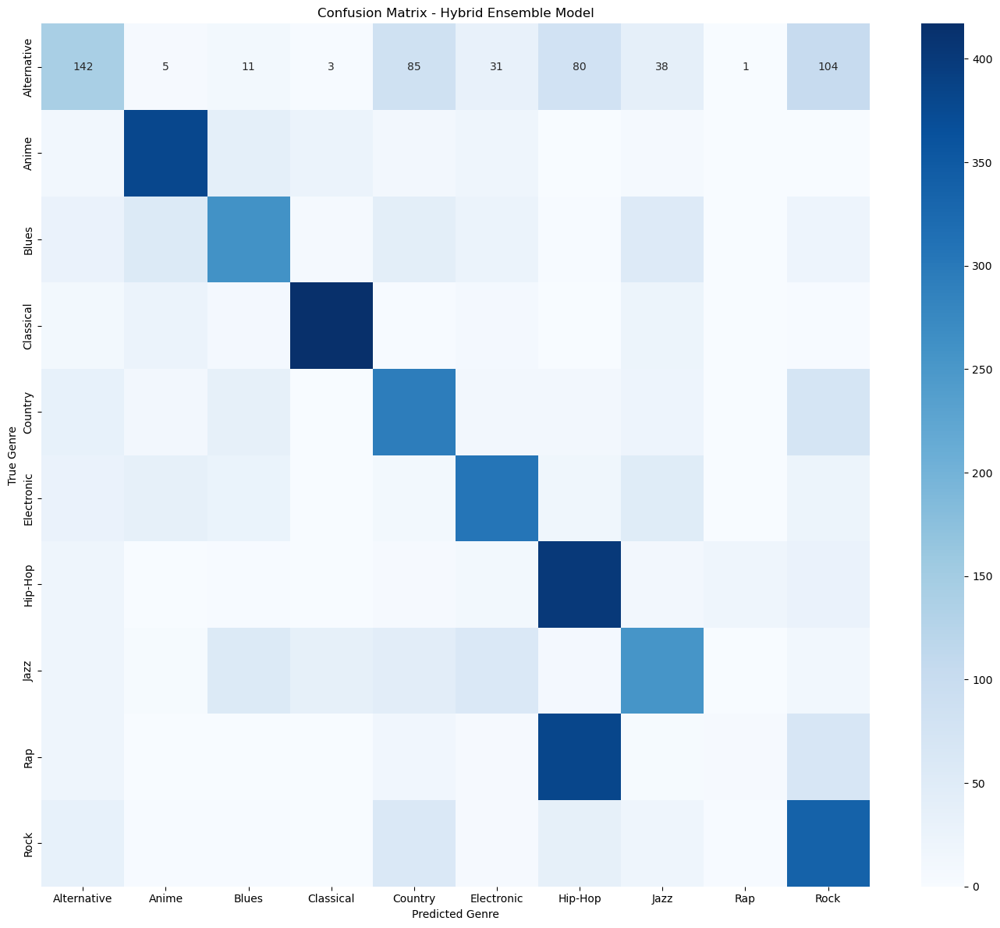

# Spotify Music Genre Classification

Can a model hear the difference between Hip-Hop and Rap? This project classifies 50,000 Spotify
tracks into ten genres from their audio features alone: no lyrics, artist names or track titles.
A tuned XGBoost model on engineered, PCA-compressed features reaches a **macro-average AUC of
0.9225** on a balanced held-out test set.

NYU machine learning capstone, April 2025. Full write-up: [Capstone_Report copy.pdf](Capstone_Report%20copy.pdf).



## Results

| Genre | AUC | | Genre | AUC |
|---|---|---|---|---|
| Classical | 0.986 | | Rap | 0.917 |
| Anime | 0.967 | | Country | 0.917 |
| Rock | 0.930 | | Jazz | 0.912 |
| Hip-Hop | 0.924 | | Blues | 0.909 |
| Electronic | 0.918 | | Alternative | 0.844 |
| **Macro average** | **0.9225** | | | |



- **Classical and Anime separate cleanly.** They sit in their own corners of feature space:
  Classical has distinctively low energy, and both are instrumental-heavy.
- **Alternative is hardest.** It spreads across the space and is confused most with Rock and
  Country.
- **Hip-Hop and Rap are nearly indistinguishable.** They make up the most-confused pair by far
  (401 mix-ups), and a specialist binary classifier for just those two scored an AUC of 0.505,
  a coin flip. On audio features alone, the two labels describe essentially the same music.

The confusion network below draws each genre as a node and the frequency of mix-ups as edge
thickness. Three clusters emerge (Alternative–Rock–Country, Hip-Hop–Rap and Blues–Jazz–Electronic),
with Classical and Anime as outliers.



## Approach

1. **Data.** 50,005 tracks with 18 columns: Spotify audio features (danceability, energy,
   loudness, speechiness, acousticness, instrumentalness, liveness, valence, tempo, duration),
   plus key and mode. Missing values (`?` and placeholder `-1` durations) are filled by KNN
   imputation (k = 5), which keeps relationships between features better than filling with means.
2. **Split.** A balanced test set of 500 tracks per genre (5,000 total), with the remaining 45,000
   for training, so every genre is evaluated equally.
3. **Encoding.** `key` is one-hot encoded and `mode` is binary encoded *before* dimensionality
   reduction, so categorical columns are never scaled as if they were continuous.
4. **Feature engineering.** Features grounded in how music works, such as energy-to-loudness
   ratio, rhythm strength (danceability × energy) and emotional intensity, plus features aimed at
   specific confusions: rap vocal focus for Hip-Hop vs Rap, rock intensity for Alternative vs Rock,
   jazz complexity for Jazz vs Blues. **47 features in total.**
5. **Dimensionality reduction.** PCA compresses the 47 features to **15 components while keeping
   95% of the variance**.
6. **Model.** XGBoost, tuned with `RandomizedSearchCV` (3-fold, best: `max_depth=4`,
   `learning_rate=0.08`, `n_estimators=497`). It needs no normality assumptions (the audio
   features are far from normal) and its L1/L2 regularisation helps against overfitting the
   engineered features.
7. **Hybrid ensemble.** Specialist binary classifiers for the most-confused pairs (Hip-Hop/Rap,
   Alternative/Rock, Jazz/Blues) adjust the main model's probabilities wherever it predicts one
   of those genres.
8. **Evaluation.** One-vs-rest ROC curves per genre, macro-average AUC, a confusion matrix, t-SNE
   projections of the feature space and the confusion network above.



## Running it

The notebook expects `musicData.csv` in the same folder. The dataset is not included in this
repository.

```bash
pip install pandas numpy scikit-learn xgboost matplotlib seaborn networkx
jupyter notebook "Capstone_Code copy.ipynb"
```

Random seeds are fixed at the top of the notebook. The saved outputs and the report come from an
earlier seed, so a fresh run gives slightly different numbers (the test-set sample and model
initialisation change), with the same overall picture.

## What I'd try next

- Text features from artist and track names, which likely carry genre signal the audio misses.
- Sub-genre labels for Alternative, whose spread suggests it isn't one coherent class.
- Deep models on raw audio or spectrograms instead of Spotify's summary features.

## Stack

Python · pandas · scikit-learn · XGBoost · PCA · t-SNE · NetworkX · Matplotlib · seaborn
